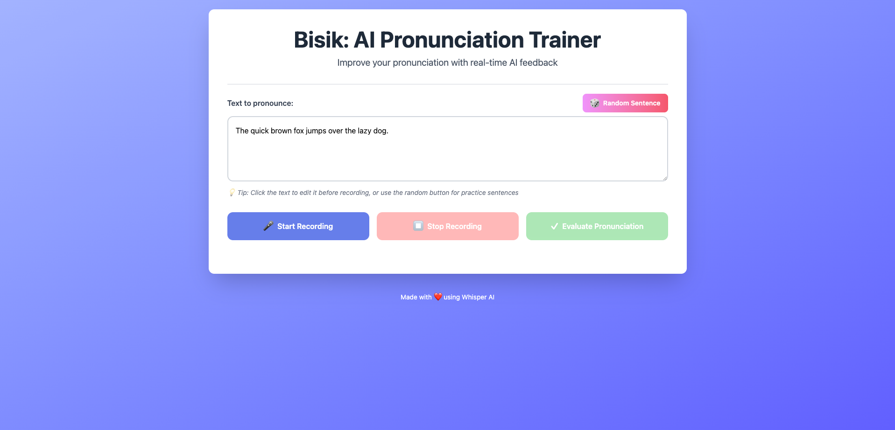
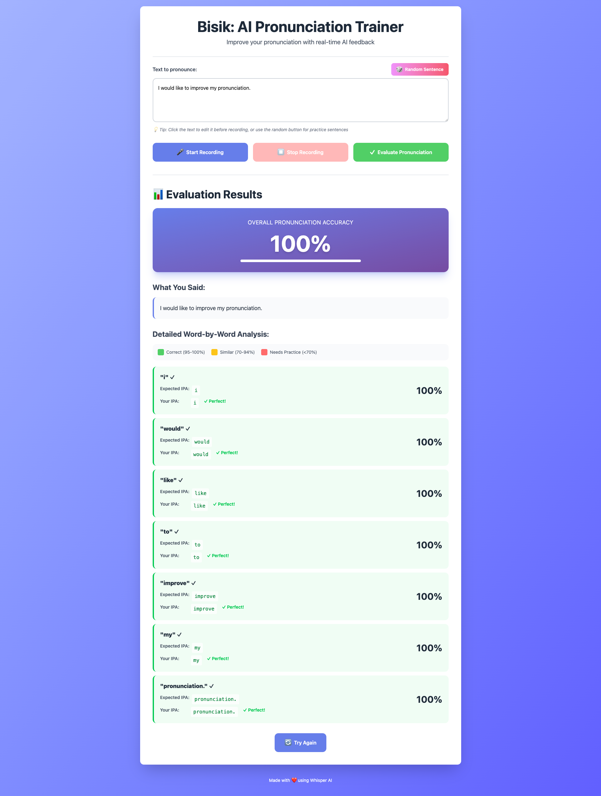

# Bisik
An AI-powered tool to evaluate and improve your pronunciation.



## Features
- Real-time pronunciation evaluation using AI
- Word-level accuracy scoring with detailed feedback
- Phonetic transcription (IPA) comparison
- Visual feedback with color-coded results
- Support for multiple languages
- REST API for integration

## How It Works

1. **Record** - Speak the provided text or your own phrase
2. **Analyze** - AI processes your speech and compares it to expected pronunciation
3. **Get Feedback** - Receive detailed word-by-word analysis with phonetic breakdowns



## Supported Languages

- English (en)

The system is extensible and can support additional languages by adding new phoneme converters.

## Technology Stack

- **Backend**: Flask (Python web framework)
- **Speech Recognition**: OpenAI Whisper (state-of-the-art ASR)
- **Phonetic Analysis**: Epitran & Panphon (IPA conversion and comparison)
- **ML Framework**: PyTorch (for running Whisper models)
- **Architecture**: Clean layered architecture with dependency injection

## Prerequisites

- Python 3.9 or higher
- 2-4 GB disk space (for Whisper models)
- Microphone access (for recording)

## Documentation
- [Architecture](docs/architecture.md)
- [API Reference](docs/api.md)
- [Contributing](docs/contributing.md)

## Quick Setup

1. Create virtual environment
```
python -m venv venv
source venv/bin/activate  # Windows: venv\Scripts\activate
```
2. Install dependencies
```
pip install -r requirements.txt
```

3. Setup environment
```
cp .env.example .env
```

4. Download models (optional, will download on first use)
```
python scripts/download_models.py
```

5. Initialize databases
```
python scripts/setup_database.py
```

6. Run the application
```
python app.py
```

The application will be available at `http://localhost:3000`

## Usage

### Web Interface

1. Open your browser to `http://localhost:3000`
2. Click "Start Recording" and speak the provided text
3. Click "Stop Recording" when finished
4. Click "Evaluate Pronunciation" to get your results
5. Review detailed feedback including:
   - Overall pronunciation accuracy score
   - Word-by-word comparison
   - Expected vs actual phonetic transcription (IPA)
   - Color-coded feedback (green = correct, yellow = close, red = needs work)

### API Usage

The application provides a REST API for programmatic access:

```bash
curl -X POST http://localhost:3000/api/evaluate \
  -F "audio=@recording.ogg" \
  -F "expected_text=Hello world" \
  -F "language=en"
```

See [API Reference](docs/api.md) for complete documentation.

## Testing

```bash
# Run all tests with coverage
pytest --cov=src tests/

# Run specific test file
pytest tests/unit/test_phonetics.py

# Quick integration tests
python test_upload.py
python test_evaluation.py
```

## Production Deployment

For production environments, use gunicorn:

```bash
gunicorn -w 4 -b 0.0.0.0:3000 'web.app_factory:create_app()'
```

## License

This project is available for educational and personal use.

## Acknowledgments

- [OpenAI Whisper](https://github.com/openai/whisper) - Automatic speech recognition
- [Epitran](https://github.com/dmort27/epitran) - Phonetic transcription
- [Panphon](https://github.com/dmort27/panphon) - Phonological feature vectors
